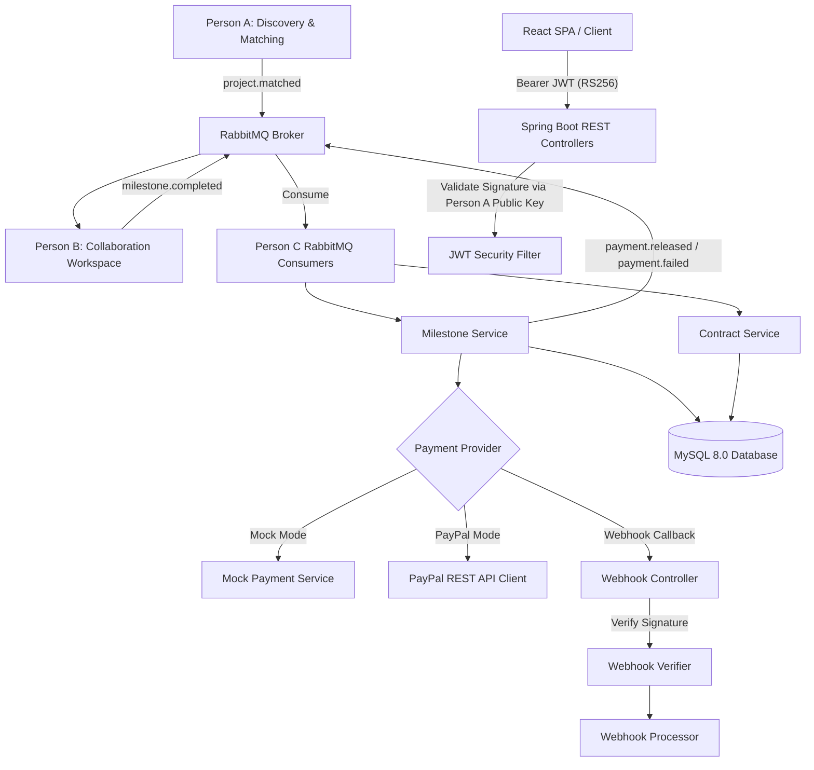

# Person C — Payment Escrow & Milestone System

A production-grade, secure Escrow, Contracts, Milestones, and Payments microservice for the **DevCollab** platform. Built with **Spring Boot 3 (Java 21)**, **MySQL**, **RabbitMQ**, **PayPal / Mock Payments**, and a responsive **React Dashboard (Vite + TypeScript + TailwindCSS)**.

---

## 1. Overview & Responsibilities

**Person C** owns financial contract management and payment release execution across the DevCollab platform lifecycle:
- **Escrow Contract Creation**: Creating milestone-based contracts triggered automatically when a startup selects an applicant (`project.matched` from Person A).
- **Milestone Management**: Tracking milestone status progression (`PENDING` → `APPROVED` → `PAYMENT_PROCESSING` → `RELEASED` / `FAILED`).
- **Payment Gateway Integration**: Supporting real PayPal Checkout REST API orders & captures as well as an offline `Mock` provider for local development.
- **Webhook Verification**: Validating payment provider webhook HMAC/transmission signatures before confirming transactions.
- **Idempotency & Deduplication**: Ensuring payments, API requests, and RabbitMQ events are processed exactly once.
- **Immutable Financial Audit Trail**: Maintaining append-only audit logs with database-level triggers blocking updates/deletes.

---

## 2. Overall Platform Architecture



---

## 3. Technology Stack

- **Framework**: Spring Boot 3.2.5
- **Language**: Java 21
- **Database**: MySQL 8.0 with Flyway Migrations (V1 to V8)
- **Messaging**: RabbitMQ (Spring AMQP)
- **Security**: Spring Security + JJWT (RS256 Signature Verification)
- **Payment Gateways**: PayPal Checkout REST API (WebClient) + Mock Gateway
- **Frontend**: React 18, TypeScript, Vite, TailwindCSS, Lucide Icons, Axios
- **Testing**: JUnit 5, Mockito, Spring Boot Test, H2 In-Memory DB

---

## 4. How to Run

### Option A: Docker Compose (Full Stack - Recommended)

```powershell
# 1. Navigate to Person C folder
cd "Payment Escrow & Milestone System"

# 2. Build and start containers (MySQL, RabbitMQ, Escrow Service, Frontend)
docker compose up --build -d

# 3. Verify container status
docker compose ps
```

- **Frontend SPA**: `http://localhost:5173`
- **Backend REST API**: `http://localhost:8080` (or `http://localhost:5173/api`)
- **Swagger Documentation**: `http://localhost:8080/swagger-ui.html`
- **RabbitMQ Management**: `http://localhost:15672` (Credentials: `guest` / `guest`)

### Option B: Local Maven Execution

```powershell
# Run backend tests
cd "Payment Escrow & Milestone System\escrow-service"
.\mvnw.cmd test

# Run Spring Boot service locally
.\mvnw.cmd spring-boot:run
```

---

## 5. Environment Variables

See [.env.example](file:///d:/Projects/DevCollab-Freelance-Platform-for-Tech-Students/Payment%20Escrow%20&%20Milestone%20System/.env.example) for full variable declarations:

| Variable | Description | Default |
|----------|-------------|---------|
| `PAYMENT_PROVIDER` | Active provider (`mock` or `paypal`) | `mock` |
| `PAYPAL_CLIENT_ID` | PayPal Sandbox Client ID | `placeholder` |
| `PAYPAL_CLIENT_SECRET` | PayPal Sandbox Client Secret | `placeholder` |
| `PAYPAL_MODE` | PayPal Environment (`sandbox` or `live`) | `sandbox` |
| `JWT_ISSUER` | Expected JWT Issuer from Person A | `devcollab-auth` |
| `JWT_PUBLIC_KEY` | Path to RSA Public Key | `classpath:keys/public.pem` |
| `RABBITMQ_HOST` | RabbitMQ Host | `localhost` |
| `DB_HOST` | MySQL Host | `localhost` |

---

## 6. API Endpoints Summary

See [API.md](file:///d:/Projects/DevCollab-Freelance-Platform-for-Tech-Students/Payment%20Escrow%20&%20Milestone%20System/API.md) for detailed JSON schemas:
- `POST /api/contracts` — Create escrow contract & milestones (`STARTUP`, `ADMIN`)
- `GET /api/contracts/{id}` — Get contract details (`STARTUP`, `STUDENT`, `ADMIN`)
- `POST /api/milestones/{id}/approve` — Approve milestone deliverable (`STARTUP`, `ADMIN`)
- `POST /api/milestones/{id}/release` — Trigger payment release order (`STARTUP`, `ADMIN`)
- `POST /api/payments/webhook` — Provider webhook receiver (Public, Signature Verified)
- `GET /api/audit` — Query immutable audit log (`ADMIN`)

---

## 7. Payment Flow

1. **Initiation**: Startup approves milestone (`POST /api/milestones/{id}/release`).
2. **Order Creation**: Person C contacts PayPal/Mock provider to create an order. Order details (`provider_order_id`, `approve_url`) are persisted in `transactions` table (`INITIATED`/`PENDING`).
3. **Payer Approval**: Student/Startup completes payment via PayPal SDK or mock checkout link.
4. **Webhook Processing**: Provider posts event to `POST /api/payments/webhook`.
5. **Release Confirmation**: Webhook Processor verifies signature, updates transaction status to `SUCCESS`, transitions milestone status to `RELEASED`, logs audit event, and publishes `payment.released` to RabbitMQ.

---

## 8. Webhook Verification Flow

1. Webhook request arrives at `POST /api/payments/webhook`.
2. Normal JWT authentication is bypassed (`permitAll()`) as webhooks originate from external provider servers.
3. `WebhookVerifier` calls `paymentService.verifyWebhookSignature(rawPayload, headers...)`.
4. PayPal signatures are verified against PayPal's verification endpoint using transmission headers. Mock mode verifies header presence.
5. Invalid webhooks return `401 Unauthorized` and are rejected before any state changes occur.

---

## 9. RabbitMQ Event Integration

See [EVENTS.md](file:///d:/Projects/DevCollab-Freelance-Platform-for-Tech-Students/Payment%20Escrow%20&%20Milestone%20System/EVENTS.md) for contract payloads:
- **Consumes `project.matched`** (from Person A): Auto-creates escrow contract and milestone schedule.
- **Consumes `milestone.completed`** (from Person B): Validates stored milestone amount and triggers payment release.
- **Publishes `payment.released`**: Notifies Person B when payment clears.
- **Publishes `payment.failed`**: Notifies Person B if payment fails.

---

## 10. Database Schema & Flyway Migrations

- **`contracts`**: Escrow contract record (`id`, `project_id`, `startup_id`, `student_id`, `total_amount`, `status`).
- **`milestones`**: Individual payment phase deliverables (`contract_id`, `amount`, `sequence_order`, `status`, `idempotency_key`).
- **`transactions`**: Payment provider orders (`milestone_id`, `provider_transaction_id`, `provider_order_id`, `amount`, `status`, `idempotency_key`).
- **`audit_logs`**: Append-only audit record. Implements database trigger `trg_audit_logs_no_update` preventing `UPDATE` operations.
- **`processed_events`**: Tracking table for RabbitMQ and webhook idempotency deduplication.

---

## 11. Idempotency & Consistency Design

- **HTTP Requests**: Handled via `Idempotency-Key` header stored in `transactions` and `milestones`.
- **RabbitMQ Consumers**: `ProcessedEvent` table tracks `event_id`. Duplicate events ACK without re-execution.
- **Database Constraints**: `UNIQUE(provider_transaction_id)` and `UNIQUE(idempotency_key)` enforce final safety.
- **CAP Theorem Stance**: Intentionally **CP-oriented** (Consistency over Availability) to guarantee zero double-payments.

---

## 12. Audit Logging

- Audit actions: `CONTRACT_CREATED`, `CONTRACT_ACTIVATED`, `MILESTONE_APPROVED`, `PAYMENT_INITIATED`, `WEBHOOK_VERIFIED`, `PAYMENT_RELEASED`, `PAYMENT_FAILED`, `DUPLICATE_EVENT_IGNORED`.
- Written asynchronously with `Propagation.REQUIRES_NEW` so failed transactions still produce immutable audit records.

---

## 13. Security & RS256 Verification

- **Public Key**: `src/main/resources/keys/public.pem` matching Person A's public RSA key.
- **JWT Claims**: Validates signature, expiry, issuer (`devcollab-auth`), subject (User UUID), and roles (`STARTUP`, `STUDENT`, `ADMIN`).
- **Authorization**: Enforced via Spring Security `@PreAuthorize` method security.

---

## 14. Docker Setup

Container stack includes:
- `mysql-c`: MySQL 8.0 database
- `devcollab-rabbitmq`: RabbitMQ 3.13 Management
- `devcollab-escrow-service`: Spring Boot backend
- `devcollab-escrow-frontend`: Nginx + React SPA

---

## 15. Testing

Run full unit and integration test suite:
```powershell
cd escrow-service
.\mvnw.cmd test
```
Includes end-to-end integration tests covering contract creation, milestone approval, release, idempotency, webhook validation, and event handling.

---

## 16. Integration with Person A

- Person A owns user identity and project matching.
- Person C stores `projectId`, `studentId`, and `startupId` as opaque reference IDs.
- Person C verifies JWTs signed by Person A's private key.
- Person C consumes `project.matched` events published by Person A.

---

## 17. Integration with Person B

- Person B publishes `milestone.completed` when a student submits work.
- Person C validates the milestone amount against its authoritative database record.
- Person C publishes `payment.released` and `payment.failed` events to notify Person B of payment outcomes.
