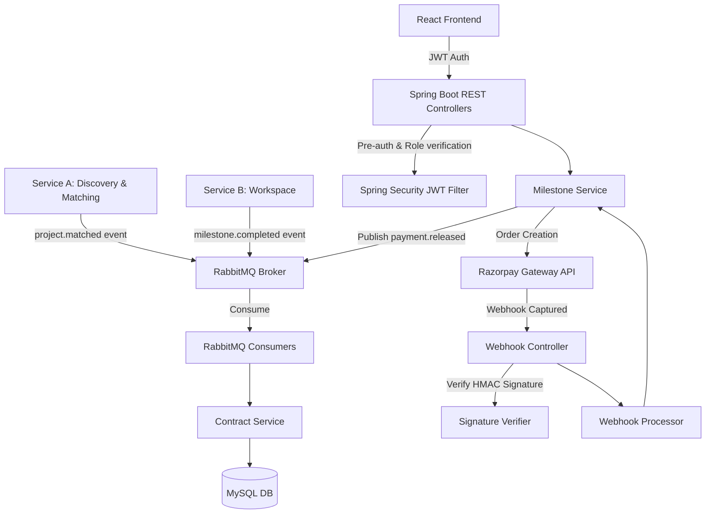

# DevCollab Escrow Service (Service C)

A production-grade, secure Escrow, Contracts, Milestones, and Payments microservice for the **DevCollab** platform. Built with **Spring Boot 3 (Java 21)**, **MySQL**, **RabbitMQ**, **Razorpay**, and a responsive **React Dashboard (Vite + TypeScript + TailwindCSS)**.

---

## Architecture Overview



### Key Technical Specs

- **RS256 JWT Authentication**: Trusts signatures signed by Service A's private key. Public key is loaded at startup.
- **Idempotent Consumers**: Prevents duplicate RabbitMQ processing by keeping an tracking table of processed event IDs.
- **Razorpay Test Integration**: Utilizes orders API with complete webhook signature verification (HMAC-SHA256).
- **Immutable Auditing**: Database level constraints prevent updates to audit log entries once written.
- **Clean Architecture**: Strong boundary separations with distinct JPA entity definitions and MapStruct mapped DTO classes.

---

## Directory Structure

```
.
├── docker-compose.yml                     # Launches DB, Broker, Backend, and Frontend
├── escrow-service/                        # Spring Boot Microservice
│   ├── src/main/java                      # Enterprise architecture package layout
│   ├── src/main/resources
│   │   ├── db/migration                   # Flyway Migrations (V1 to V5)
│   │   └── keys                           # RSA Validation public keys
│   ├── src/test                           # JUnit 5 & Mockito test suite
│   └── Dockerfile
└── escrow-frontend/                       # React TypeScript Single Page App
    ├── src/components                     # Skeletons, Badges, Modals, Navbar, Sidebar
    ├── src/pages                          # Dashboard, Contracts, Milestones, Ledger
    ├── src/api                            # Grouped Axios endpoints
    └── Dockerfile
```

---

## API Endpoints

### Contracts
- `POST /api/contracts` - Create manual escrow contracts (STARTUP, ADMIN roles)
- `GET /api/contracts/{id}` - Fetch single contract details
- `GET /api/contracts/project/{projectId}` - Get contracts mapped to a match ID
- `POST /api/contracts/{id}/cancel` - Request contract cancel

### Milestones
- `POST /api/milestones` - Register a payment milestone phase
- `PUT /api/milestones/{id}` - Update milestone information
- `POST /api/milestones/{id}/approve` - Approve work deliverables
- `POST /api/milestones/{id}/release` - Create Razorpay order to trigger release

### Transactions & Audits
- `GET /api/transactions` - Fetch list of checkout orders
- `GET /api/transactions/{id}` - Retrieve detailed transfer transaction
- `GET /api/audit` - Search immutable audit log trails (ADMIN role only)

### Webhook
- `POST /api/payments/webhook` - Razorpay capture webhook (JWT Bypassed, HMAC Verified)

---

## Installation & Setup

### Local Prerequisites
- Java 21 JDK
- Node.js v20+
- Docker & Docker Compose
- RabbitMQ
- MySQL Server

### Quick Start with Docker Compose
Run the entire platform including database, broker queue, and frontend in one command:

```bash
# Add Razorpay Test Credentials (or use mock fallbacks)
export RAZORPAY_KEY_ID=rzp_test_yourkey
export RAZORPAY_KEY_SECRET=yoursecret
export RAZORPAY_WEBHOOK_SECRET=yourwebhooksecret

docker-compose up --build
```

- **Frontend Application**: `http://localhost:5173`
- **Backend API**: `http://localhost:8080`
- **Swagger Documentation**: `http://localhost:8080/swagger-ui.html`
- **RabbitMQ Management**: `http://localhost:15672` (guest / guest)
- **Actuator Health**: `http://localhost:8080/actuator/health`

### Running Backend Independently
Navigate into the backend package and launch the maven compiler:

```bash
cd escrow-service
./mvnw clean spring-boot:run
```

### Running Frontend Independently
Navigate into the frontend directory (`escrow-frontend`):

```bash
cd escrow-frontend
npm install
npm run dev
```
