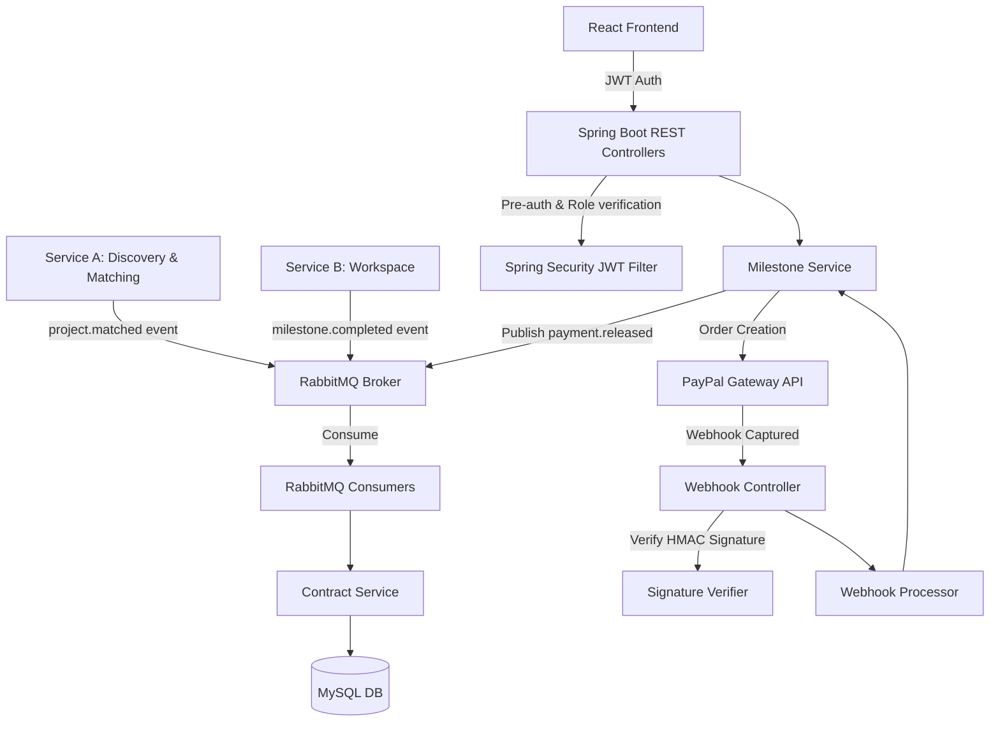

# DevCollab Escrow Service (Service C)

A production-grade, secure Escrow, Contracts, Milestones, and Payments microservice for the **DevCollab** platform. Built with **Spring Boot 3 (Java 21)**, **MySQL**, **RabbitMQ**, **PayPal**, and a responsive **React Dashboard (Vite + TypeScript + TailwindCSS)**.

---

## Architecture Overview


```mermaid
graph TD
    ServiceA[Service A: Discovery & Matching] -- project.matched event --> RabbitMQ[RabbitMQ Broker]
    ServiceB[Service B: Workspace] -- milestone.completed event --> RabbitMQ
    RabbitMQ -- Consume --> Consumer[RabbitMQ Consumers]
    Consumer --> ContractService[Contract Service]
    ContractService --> DB[(MySQL DB)]

    Client[React Frontend] -- JWT Auth --> REST[Spring Boot REST Controllers]
    REST -- Pre-auth & Role verification --> SecurityFilter[Spring Security JWT Filter]
    REST --> MilestoneService[Milestone Service]
    
    MilestoneService -- Order Creation --> PayPal[PayPal Gateway API]
    PayPal -- Webhook Captured --> WebhookController[Webhook Controller]
    WebhookController -- Verify HMAC Signature --> WebhookVerifier[Signature Verifier]
    WebhookController --> WebhookProcessor[Webhook Processor]
    WebhookProcessor --> MilestoneService
    MilestoneService -- Publish payment.released --> RabbitMQ
```

### Key Technical Specs

- **RS256 JWT Authentication**: Trusts signatures signed by Service A's private key. Public key is loaded at startup.
- **Idempotent Consumers**: Prevents duplicate RabbitMQ processing by keeping an tracking table of processed event IDs.
- **PayPal Checkout Integration**: Real PayPal Orders REST API via WebClient (order create/capture), with webhook signature verification.
- **Mock Payment Provider**: `payment.provider=mock` (default) enables offline/demo payments without PayPal credentials.
- **Immutable Auditing**: Database level constraints prevent updates to audit log entries once written.
- **Clean Architecture**: Strong boundary separations with distinct JPA entity definitions and MapStruct mapped DTO classes.

---

## Directory Structure

```
.
├── docker-compose.yml                     # Launches DB, Broker, Backend, and Frontend
├── escrow-service/                        # Spring Boot Microservice
│   ├── src/main/java                      # Enterprise architecture package layout
│   ├── src/main/resources
│   │   ├── db/migration                   # Flyway Migrations (V1 to V5)
│   │   └── keys                           # RSA Validation public keys
│   ├── src/test                           # JUnit 5 & Mockito test suite
│   └── Dockerfile
└── escrow-frontend/                       # React TypeScript Single Page App
    ├── src/components                     # Skeletons, Badges, Modals, Navbar, Sidebar
    ├── src/pages                          # Dashboard, Contracts, Milestones, Ledger
    ├── src/api                            # Grouped Axios endpoints
    └── Dockerfile
```

---

## API Endpoints

### Contracts
- `POST /api/contracts` - Create manual escrow contracts (STARTUP, ADMIN roles)
- `GET /api/contracts/{id}` - Fetch single contract details
- `GET /api/contracts/project/{projectId}` - Get contracts mapped to a match ID
- `POST /api/contracts/{id}/cancel` - Request contract cancel

### Milestones
- `POST /api/milestones` - Register a payment milestone phase
- `PUT /api/milestones/{id}` - Update milestone information
- `POST /api/milestones/{id}/approve` - Approve work deliverables
- `POST /api/milestones/{id}/release` - Create a PayPal order to trigger release

### Transactions & Audits
- `GET /api/transactions` - Fetch list of checkout orders
- `GET /api/transactions/{id}` - Retrieve detailed transfer transaction
- `GET /api/audit` - Search immutable audit log trails (ADMIN role only)

### Webhook
- `POST /api/payments/webhook` - PayPal capture webhook (JWT Bypassed, HMAC Verified)

---

## Installation & Setup

### Local Prerequisites
- **Docker Desktop** (Windows) or Docker Engine (Linux/macOS) — required for the full-stack path
- **Java 21 JDK** — only needed for the standalone/backend path
- **Node.js v20+** — only needed for the standalone/frontend path
- **RabbitMQ & MySQL** — only if running the backend standalone (not using Docker)

> ⚠️ **Important (Windows)**: Before running any `docker` command, **start Docker Desktop** and wait until the
> tray/whale icon shows it is **running** (not paused). If you see
> `failed to connect to the docker API at npipe:////./pipe/dockerDesktopLinuxEngine`, it means the Docker
> daemon is not running — start Docker Desktop and try again.

### Quick Start with Docker Compose (Recommended)

Run the entire platform — database, message broker, backend, and frontend — in one command:

```bash
# 0. IMPORTANT: Start Docker Desktop first and wait for it to be fully running.

# 1. (Optional) Configure PayPal sandbox credentials.
#    If omitted, the app falls back to the MOCK payment provider — no credentials needed.
export PAYPAL_CLIENT_ID=your_sandbox_client_id
export PAYPAL_CLIENT_SECRET=your_sandbox_secret
export PAYPAL_WEBHOOK_ID=your_webhook_id
export VITE_PAYPAL_CLIENT_ID=your_sandbox_client_id   # used by the frontend PayPal buttons

# 2. Build and start everything (first run downloads images + builds jars)
docker compose up --build -d

# 3. Verify all containers are running and healthy
docker compose ps

# 4. Stop everything (the -v flag also wipes the MySQL/RabbitMQ volumes)
docker compose down -v
```

For **Windows PowerShell**, use `$env:` instead of `export`:

```powershell
$env:PAYPAL_CLIENT_ID = "your_sandbox_client_id"
$env:PAYPAL_CLIENT_SECRET = "your_sandbox_secret"
docker compose up --build -d
```

> **Note**: The obsolete `version: "3.9"` attribute has been removed from `docker-compose.yml` — modern Docker Compose v2 ignores it and prints a warning otherwise.

> **How the frontend reaches the backend**: The built SPA uses relative `/api/*` paths.
> In Docker Compose, the frontend container's nginx reverse-proxies `/api` to the
> `escrow-service` container, so the browser never needs to know the backend host.
> This works out of the box — no `VITE_API_BASE_URL` is required.

**Access the running apps:**
- Frontend Application: `http://localhost:5173`
- Backend API (via nginx proxy): `http://localhost:5173/api/...`
- Backend API (direct): `http://localhost:8080`
- Swagger Documentation: `http://localhost:8080/swagger-ui.html`
- RabbitMQ Management: `http://localhost:15672` (`guest` / `guest`)
- Actuator Health: `http://localhost:8080/actuator/health` → should return `{"status":"UP"}`

### Payment Provider Selection

`payment.provider` controls which implementation is active:

| Provider | Value | Requires |
|----------|-------|----------|
| **Mock** (default) | `mock` | nothing |
| **PayPal** | `paypal` | `PAYPAL_CLIENT_ID`, `PAYPAL_CLIENT_SECRET` (and optionally `PAYPAL_WEBHOOK_ID` for webhooks) |

In Docker Compose, set `PAYMENT_PROVIDER` in your environment or `.env`:

```bash
export PAYMENT_PROVIDER=paypal
```

### JWT Public Key

The service validates RS256 JWTs issued by Service A. The public key is bundled at
`escrow-service/src/main/resources/keys/public.pem`. To use a different key at runtime:

```bash
export JWT_PUBLIC_KEY=/absolute/path/to/public.pem   # or classpath:keys/public.pem
export JWT_ISSUER=devcollab-auth
```

### Running Backend Independently

Requires a running **MySQL** and **RabbitMQ**. The default `application.yml` already points at
`localhost:3306` with user `escrow_user` / password `escrow_pass`, and RabbitMQ at `localhost:5672`.

The easiest way to get MySQL + RabbitMQ running is to start just those two services via Docker Compose:

```bash
# Start ONLY the infrastructure (no app containers)
cd D:\Projects\DevCollab-Freelance-Platform-for-Tech-Students
docker compose up -d mysql rabbitmq

# Wait until both show "(healthy)", then run the backend:
cd escrow-service
./mvnw clean spring-boot:run
```

> If you get `Communications link failure` / `Connection refused` on port 3306, MySQL is not running —
> start it with the `docker compose up -d mysql` command above and wait for it to be healthy.

### Running Frontend Independently

```bash
cd escrow-frontend
npm install
npm run dev
```

The Vite dev server proxies `/api` to `http://localhost:8080`, so the backend should be running too.

### Running Tests

```bash
cd escrow-service
./mvnw test
```

---

## Troubleshooting

| Symptom | Cause | Fix |
|---------|-------|-----|
| `failed to connect to the docker API at npipe:////./pipe/dockerDesktopLinuxEngine` | Docker Desktop is not running. | **Start Docker Desktop** and wait for it to be ready, then re-run the command. |
| `Communications link failure` / `Connection refused` on port **3306** | MySQL is not running. | `docker compose up -d mysql` and wait for `(healthy)`. |
| `Connection refused` on port **5672** | RabbitMQ is not running. | `docker compose up -d rabbitmq` and wait for `(healthy)`. |
| Backend container keeps restarting / not healthy | Startup error (e.g. DB connection or Flyway). | `docker compose logs escrow-service` to inspect the error. |
| Hibernate schema-validation error on enum columns | Entity enum validation mismatch with the VARCHAR columns. | Already fixed via `@JdbcTypeCode(SqlTypes.VARCHAR)` on the enum fields in `AuditLog`, `Contract`, `Milestone`, and `Transaction`. |
| Port **8080** or **5173** already in use | Another process is using the port. | Stop the conflicting process, or change the port mapping in `docker-compose.yml`. |
| `docker compose ps` shows a container stuck in "restarting" | A stale build or leftover state. | `docker compose down -v && docker compose up --build -d` for a clean rebuild. |
| Changes to Java code not reflected | Old image still in use. | Rebuild: `docker compose up --build -d`. |

### Useful Commands

```bash
# View logs of a specific service
docker compose logs -f escrow-service
docker compose logs -f escrow-frontend

# Check container health/status
docker compose ps

# Stop everything (keep data volumes)
docker compose down

# Stop everything and wipe MySQL/RabbitMQ volumes (fresh start)
docker compose down -v

# Rebuild images after code changes and restart
docker compose up --build -d
```
